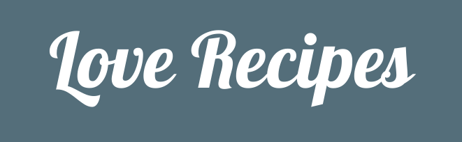

  

# Love Recipes

This is a website where a user can go to either find a recipe or add their own recipe to share with other users. It's an online cookbook that users can add to, edit or delete recipes from, making it more versatile than a physical book.

Users can find recipes anywhere and anytime as the site is mobile friendly as well as working on larger screen sizes.

## Deployment
The website is deplyed at https://love-recipes.herokuapp.com/.

In order to deploy the website locally, click download and copy the link provided. Next go to your terminal and navigate to the desired directory, then use 'git clone' and paste in the link you just copied. This can then be opened in your choice of editor.

## Credits

### Content
- The HTML used for the full page background was copied from [CSS-TRICKS, article ‘Perfect Full Page Background Image'](https://css-tricks.com/perfect-full-page-background-image/).
- The code used for the search function was modified from [MouseVsPython](https://www.blog.pythonlibrary.org/2017/12/13/flask-101-how-to-add-a-search-form/) and [stackoverflow](https://stackoverflow.com/questions/7101703/how-do-i-make-case-insensitive-queries-on-mongodb).
- The code used to find the last inserted id to view the full recipe was modified from [stackoverflow](https://stackoverflow.com/questions/8783753/how-to-get-the-object-id-in-pymongo-after-an-insert)
- The idea to use the 'pre' tag for formatting the recipe view was taken from [stackoverflow](https://stackoverflow.com/questions/8573890/using-new-line-n-in-string-and-rendering-the-same-in-html).
- The method of formatting the 'pre' tag so the text wasn't all on a single line and fit the window size was taken from [stackoverflow](https://stackoverflow.com/questions/7132371/can-i-adjust-the-width-of-a-pre-area-to-fit-the-text).
- The code used to add the error 404 page was found at [Code Maven](https://code-maven.com/flask-return-404).

### Media
- The background photo for this website was obtained from [pxfuel](https://www.pxfuel.com/en/free-photo-omiog).
- The photo on the index page was obtained from [PxHere](https://pxhere.com/en/photo/1453277).
- The 'Shop now!' button currently links to the Amazon site for cookware [here](https://www.amazon.co.uk/kitchen-cookware-dining-glassware-cutlery-pans/b?ie=UTF8&node=392546011)
- The photo on the recipe view was obtained from [flickr](https://www.flickr.com/photos/30478819@N08/48558169527/)
